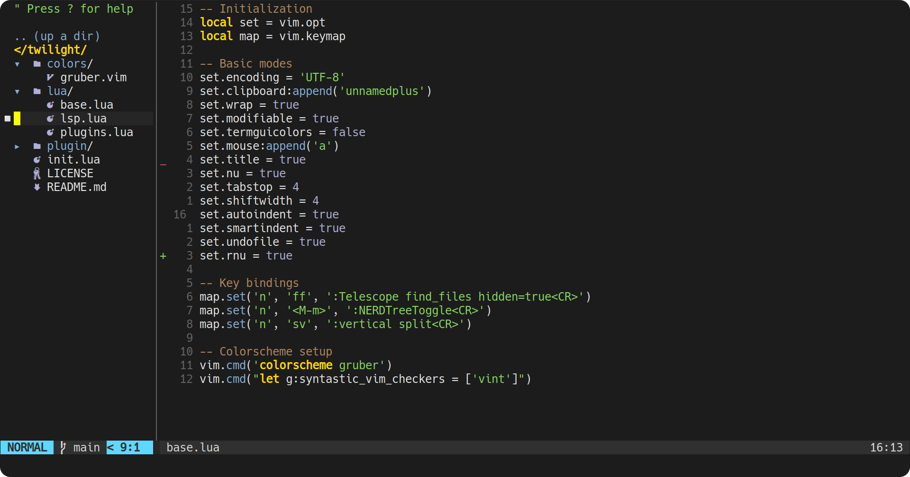

<h1 align="center">
	Twilight
</h1>

## 🤖 **Terminal setup**
* **Font:** 
* **Font size:** 18
* **Colorscheme:** 
* **Background:** #1C1C1C
>> **n.b** modifying terminal background color is needed to match with the neovim background color.

## 🎴 **Preview**

