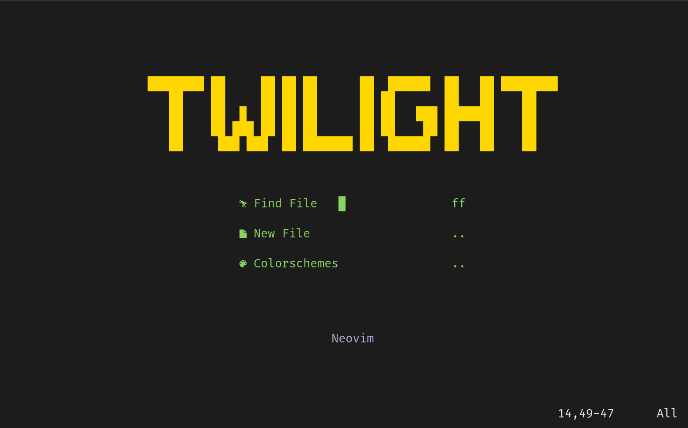

<h1 align="center">
	Twilight
</h1>

## 🎴 **Preview**



## ⚡ **Requirements**
* [Neovim 0.8+](https://github.com/neovim/neovim/releases/tag/stable)
* [Lua](https://www.lua.org/)
* [Node](https://nodejs.org/en)
* [Python3](https://www.python.org/)
* `xclip` - Universal clipboad support

## 🗺️ **Project Layout**
```
nvim
├── colors
│   └── gruber.vim
├── init.lua
├── lua
│   ├── base.lua
│   ├── lsp.lua
│   └── plugins.lua
└── plugin
    └── packer_compiled.lua
```

## 📟 **Terminal setup**
* Font: [Hack](https://github.com/ryanoasis/nerd-fonts/releases/download/v2.3.3/Hack.zip)
* Font size: 18
* Colorscheme: [Brogrammer](https://gogh-co.github.io/Gogh/)
* Background: **`#1C1C1C`**
> **n.b** modifying terminal background is needed to match with the neovim background color.

## 🛠️ **Installation**
* First things first, make the installation script `install.sh` executable.
```shell
chmod +x install.sh 
```
* Install `Packer.nvim`

```shell		
git clone --depth 1 https://github.com/wbthomason/packer.nvim\
~/.local/share/nvim/site/pack/packer/start/packer.nvim
```

* Run the installer.

```
./install.sh
```


## 📦 **Basic setup**

**Inside Neovim**

* Install plugins 
	* Enter `:PackerInstall`
* Install LSP servers
	* Enter `:Mason` and select the lsp servers you want to install
* Install treesitter language parsers
	* Enter `:TSInstall <language_persers, ... >`
	> you can find all treesitter language parsers name [here](https://github.com/nvim-treesitter/nvim-treesitter)

**Outside Neovim**

* Copy the splash screen script
```sehll
cp dashboard.lua $HOME/.local/share/nvim/site/pack/packer/start/startup.nvim/lua/startup/themes/dashboard.lua
```

